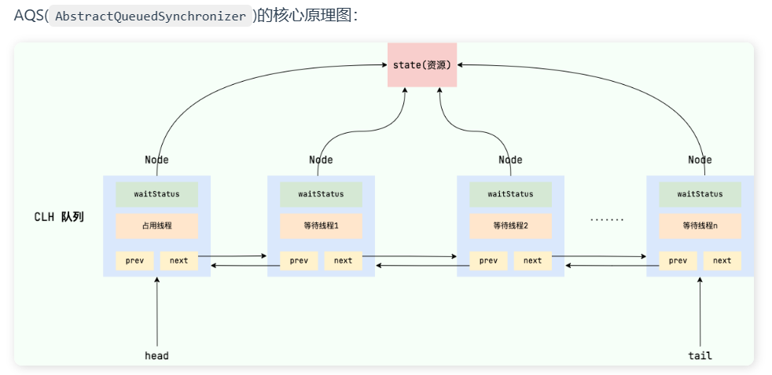

# JUC


## 1.CAS（**Compare And Swap**）

>   CAS是一种乐观锁，他的实现原理就是预期值跟要更新变量值相比较，如果相等就可以进行修改。

CAS当中设计三个参数：

-   V 要更新变量值
-   E 预期要更新的变量值
-   N 拟写入的值

当V与E相比较，如果相等说明在值没有被其他线程修改过，就可以进行操作了，如果不相等则告知线程操作失败需要重新尝试。

**举一个简单的例子**：线程 A 要修改变量 i 的值为 6，i 原值为 1（V = 1，E=1，N=6，假设不存在 ABA 问题）。

1.  i 与 1 进行比较，如果相等， 则说明没被其他线程修改，可以被设置为 6 。
2.  i 与 1 进行比较，如果不相等，则说明被其他线程修改，当前线程放弃更新，CAS 操作失败。


CAS存在的一些问题：

​				ABA问题

​				循环开销大

==ABA问题==

变量初次读取为A，再次读取还为A，这可以说明中间没被线程修改过吗？显然是不可以的。

解决办法就是版本号法，给线程添加一个计数器，执行一次修改一次，对比前后一致性。

==循环开销大==

CAS锁的过程是多个线程竞争资源只有一个线程成功，其他线程失败就会进行自旋操作，如果多次自旋还没有成功就会占用大量内存，出现内存浪费的情况。

## 2.synchronized和volatile

synchronized可以锁对象，锁方法，代码块

```java
synchronized (this) {//关键字在代码块上
            System.out.println("synchronized 代码块");
        }
synchronized void method() {//关键字在方法上
    //业务代码
}
```

他们两者都是所的当前对象，本质都是对于this进行加锁。

```java
synchronized static void method() {
    //业务代码
}
```

锁静态方法是对整个类进行加锁。

静态 `synchronized` 方法和非静态 `synchronized` 方法之间的调用互斥么？不互斥！如果一个线程 A 调用一个实例对象的非静态 `synchronized` 方法，而线程 B 需要调用这个实例对象所属类的静态 `synchronized` 方法，是允许的，不会发生互斥现象，因为访问静态 `synchronized` 方法占用的锁是当前类的锁，而访问非静态 `synchronized` 方法占用的锁是当前实例对象锁。

------

volatile修饰变量，将变量放到共享内存中，可以被多个线程看到。

使用volatile修饰变量的时候，会将该变量使多线程可见，并且会禁止重排序。

------

volatile与synchronized的区别

多线程编程需要注意三个要点：原子性，有序性，可见性。

volatile无法保证其原子性；synchronized因为本身是排他锁，在代码执行过程中不允许其他线程访问，所以具有原子性。

volatile关键字会禁止JVM对变量修改过程的重排序（JVM优化字节码执行效率的手段，但是可能出现问题）；synchronized则是保证代码的串行执行来实现有序性的

volatile会将变量放到共有内存中，实现多线程可见变量；synchronized通过monitor监视器机制，保证代码在monitorenter到monitorexit当中执行的串行化，并在monitorexit执行结束后将共享资源刷新到内存中保证可见性

## 3.AQS

>   AQS原理

多线程访问共享资源的时候，通过CAS机制判断是否可以加锁，如果不能加锁会将其余线程放到同步队列中等待锁的释放。



每个Node节点中都记录Thread。

AQS当中维护这一个变量，该变量记录这共享资源的使用状态

```java
// 共享变量，使用volatile修饰保证线程可见性
private volatile int state;
//ReentantLock中 0代表着共享资源闲置，1代表被线程占用，大于1表示同一个线程多次使用
```

`getState()`、`setState()`和`compareAndSetState()` 进行操作state值。并且，这几个方法都是 `final` 修饰的，在子类中无法被重写。

判断资源状态后，如果没有获取锁就会将线程添加到队列当中等待锁释放。

>   AQS中Node节点  （下面视频描述的很生动）
>
>   [AQS源码分析(一)[AQS类定义与Node数据结构详解\]_哔哩哔哩_bilibili](https://www.bilibili.com/video/BV1Fd4y1b7Qp/?spm_id_from=333.788&vd_source=cbc5f147230d27da561c10f22f055385)

Node节点当中包含的重要部分 waitstatus  prev next thread

排他锁标识，共享锁标识

waitstatus表示为等待状态

-   signal：表示需要唤醒下个一线程
-   cancelled：表示我这个线程有其他的事情，该共享资源我不访问了
-   waitstatus初始值：表示我啥事也不用干

## 4.ReentrantLock

## 5.锁升级

