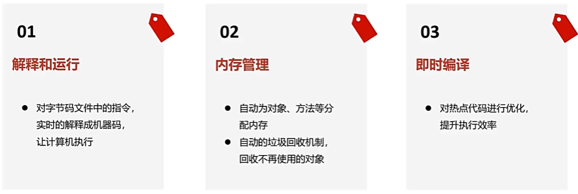
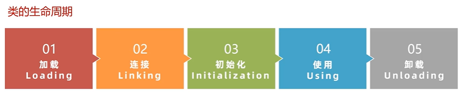
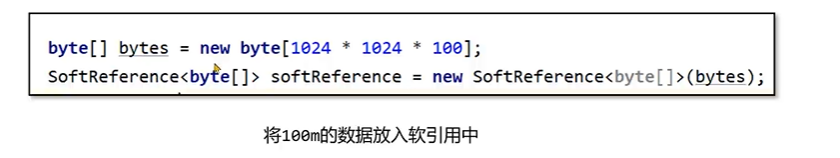
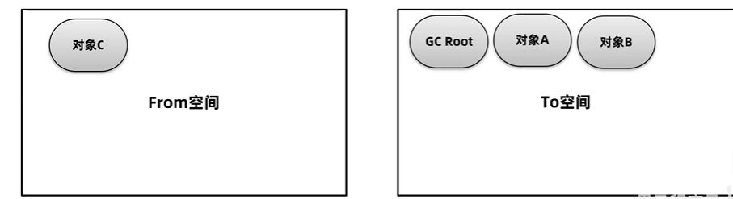
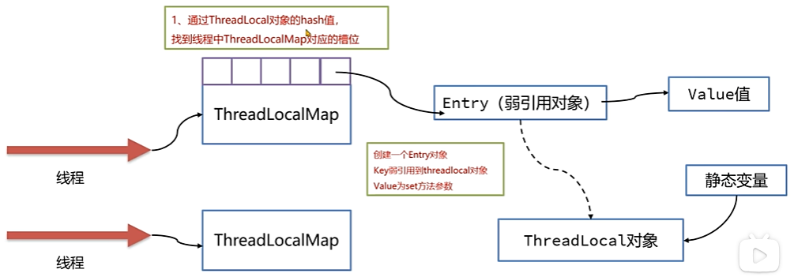

# JVM

## 基础

### 1.什么是JVM

#### JVM

==JVM（java virtual Machine）java虚拟机，他的作用是将Java字节码解释为可以被计算机理解的机器码，这样做的有点就是可以跨平台，实现”一次编译，到处运行==。


#### JVM功能

JVM三大功能

1.  解释和运行：翻译字节码文件，转换为机器码，供计算机使用
2.  内存管理：分配内存，管理对象
3.  即时编译（JIT）：将热点代码编译为字节码直接放到内存中去，提高执行效率
4.  

### 2.类加载器ClassLoad

#### 1.类的生命周期



##### 01类的加载阶段

**该阶段的作用是将类的信息（类信息可以是本地磁盘中、反射、网络传输）通过二进制数据保存到内存中去。**

在<u>内存</u>中将类的信息加载到方法区放入到InstanceKlass类中，同时在堆中将类的信息保存到java.lang.Class中，然后InstanceKlass与Java.lang.Class互相通过指针联系对方。


*问题1：为什么需要将类的信息分别保存到InstanceKlass和java.lang.Class中*

因为InstanceKlass是C++代码编写的，Java程序员具体操作不方便，同时java.lang.Class中也会简化程序员不需要了解的字段。

##### 02连接阶段


解析阶段就是将符号引用直接转为内存地址引用，减少了通过符号引用查找地址，再去找到类的过程。

final修饰的 变量和方法，在连接阶段就已经被附上值不会改变了。

##### 03初始化

初始化过程：1.给静态变量赋值

​						2.执行字节码文件中clinit部分的字节码文件（静态变量赋值的字节码文件，和java源代码执行顺序一致）

触发初始化的情况：

-   使用Class.forName(类名)  （其实调用的是forName0方法，里面的可以设置参数，可以选择是否需要初始化）
-   访问静态变量或静态方法，访问final修饰的变量是不会进行初始化的（赋值过程在连接阶段）
-   new对象
-   执行Main方法的当前类

不会出现clinit的情况：


*不会执行初始化操作的特殊情况：*

创建数组的类，类本身不会进行初始化

```java
public class Main {
    public static void main(String[] args) {
        Test1[] arr = new Test1[10];

    }
}
class Test1{
    static {
        System.out.println("1");
    }
}
```

*执行初始化的特殊情况：*

final修饰的静态变量的右边不是常量，会初始化


要点：


#### 2.类加载器

##### 类加载器分类

**类加载器的作用：**

将类的数据从本地磁盘等地方加载到内存


*类加载器的分类：*

**JDK8及以前**

java虚拟机提供的类加载器（C++）：

BootstrapClassLoader：加载java核心类，例如字符串java.lang.String

java应用程序提供的类加载器（Java）：

ExtensionClassLoader：加载java通用类，例如xml解析器

ApplicationClassLoader：加载程序员自己编写的类

**JDK9的分类**

JDK9引入module概念，将类都放在jmode文件下，不在根据urlClassLoader去寻找类了

启动类加载器，扩展类加载器，应用加载器都继承自BuiltinClassLoader

启动类加载器由原来的C++编写转为Java编写 ，BootClassLoader

扩展类加载器：PlatformClassLoader（JDK引入模块概念之后，该类使用比例下降）


##### 双亲委派机制

**双亲委派机制是为了解决什么问题哪？**

为了保护java核心类的安全性，不允许外部修改核心类。例如在外部定义了一个java.lang.String。

为了避免重复加载类，一个类同时让三个类加载器加载。

**双亲委派机制流程**


每个类加载器里面都有一个名称为parent的属性

Application->Extension

Extension->null

Extension的父类为什么是null哪，因为Bootstrap类加载器里面加载的都是核心类，是不允许去修改的，需要保证其安全性，所以获取的为null。但是在底层中parent的值为Bootstrap


##### 如何打破双亲委派机制

为什么要打破双亲委派机制：

​		当加载核心类库的时候需要使用用户自己写的代码时，就会发生问题。例如JDBC代码中的DriverManager.getConnection，加载DriverManager是在Bootstrap中加载的，但是里面的接口是第三方提供的，不属于Bootstrap核心类库。

打破双亲委派机制的三种方法：自定义类加载器，线程上下文类加载器，osgi框架

**ClassLoader中的核心方法：**（所有类加载器都继承自ClassLoader）


**双亲委派机制源代码：**

```java
protected Class<?> loadClass(String name, boolean resolve)
        throws ClassNotFoundException
    {
        synchronized (getClassLoadingLock(name)) {
            // First, check if the class has already been loaded
            Class<?> c = findLoadedClass(name);
            if (c == null) {
                long t0 = System.nanoTime();
                try {
                    if (parent != null) {
                        c = parent.loadClass(name, false);
                    } else {
                        c = findBootstrapClassOrNull(name);
                    }
                } catch (ClassNotFoundException e) {
                    // ClassNotFoundException thrown if class not found
                    // from the non-null parent class loader
                }

                if (c == null) {
                    // If still not found, then invoke findClass in order
                    // to find the class.
                    long t1 = System.nanoTime();
                    c = findClass(name);
                }
```

*自定义类加载器：*

自定义类加载器通过重写ClassLoader中**loadClass**方法来打破双亲委派机制。

defineClass方法会对输入的类名进行安全性校验，出现java开头的类，会抛出异常

*线程上下文类加载器：*

JDBC案例，[基础篇-15-打破双亲委派机制2-线程上下文类加载器_17:06](https://www.bilibili.com/video/BV1r94y1b7eS?p=17&vd_source=cbc5f147230d27da561c10f22f055385)

我支持未打破双亲委派机制，加载ApplicationClassLoader的时候肯定要使用loadClass方法去加载类，但是LoadClass方法并未重写，那不就是没有打破吗。

*osgi框架：*

### 3.JVM内存区域

#### 线程不共享区域：

-   程序计数器：程序计数器存储的是当前字节码指令的下一行指令的内存地址，当我们进行线程切换的时候可以帮助我们找到对应字节码指令位置。程序计数器不存在内存泄漏问题，因为指令的内存地址固定为8个字节

-   java虚拟机栈：采用栈这种数据结构，方法栈帧先进后出。栈帧存储方法的必要参数，分为局部变量表，操作数栈，帧数据三部分。
    -   局部变量表：存储局部变量的生效范围，该表数据结构为数据，数组每一个位置被称为槽。 非静态方法第一个位置存this实例，然后是方法参数，局部变量。Long Double占2个槽，其他类型占一个槽。槽是可以复用的
    -   操作数栈：记录临时数据存储最大所占的位置，在运行前就计算完毕。
    -   帧数据：
        -   动态链接：字节码中记录的编号，通过编号寻找到内存地址，然后在找到对应的对象
        -   异常表：记录在那一段字节码出现异常应该跳转到那一段处理逻辑
        -   方法出口：出栈方法记录着下一个要出栈方法字节码文件的执行进度，交给程序计数器处理、

java虚拟机是用内存泄漏风险的，栈大小Java虚拟机根据不同的操作系统已经分配了大小，一般不会造成内存溢出，当递归方法不当的时候可能会出现内存溢出。

VM option选项：添加-XSS1024k 可以设置虚拟机内存上线为1024kb

-   本地方法栈：

#### 线程共享区：

-   堆：内存会存在泄漏，对象创建多的时候会造成内存泄漏

-   方法区：存储类的基本信息，运行时常量池（放置在元空间中），字符常量池（放置在堆内存中）等信息。jdk1.7以前使用持久代放在堆内存中，1.8使用元空间存储，放置在操作系统内存中。
    -   字符串常量池：


结果是false，原因是变量与变量相加，在字节码文件中相当于使用StringBuilder.append方法，创建了新的字符串对象


结果是true，原因是常量与常量之间的操作先去字符串常量池中找对应地址，如果存在即引用


在JDK1.7的时候 intern方法相当于在字符串常量池中再创建一个字符串，而原本的s1是new出来的放在堆内存中的，所以不相等。

JDK1.8的时候intern方法创建字符串常量池内容是引用堆内存地址来完成的，两者都为堆地址。

因为java在虚拟机启动的时候就会被加载到字符串常量池中的，所以是false，一个字符串常量池，一个堆

**在jdk1.7之后堆对象调用intern方法是去字符串常量池中存放对象的引用，而不是重新创建常量**

JDK1.7以前静态常量放在方法区中，之后放在堆中的Class对象里面

### 4.JVM垃圾回收

***因为线程共享区中的数据随着线程的销毁而结束，不需要进行垃圾回收。***

***垃圾回收只要在线程共享区***

#### **方法区回收**：

1.  此类的实例对象已经被回收了，在堆中不存在任何该类的实例对象及其引用
2.  加载该类的类加载器已经被回收
3.  对应的java.lang.Class对象在任何地方没有引用

#### **堆内存回收：**

##### **如何判断对象是否可以回收的两种算法**：

1.  引用计数法：原理就是给每一个对象添加一个引用计数器，统计该对象的引用次数，如果计数器为0就表明可以回收了。

存在的问题：两个对象相互引用，那不就不能回收了。

  2.**可达性分析算法**：JVM默认采用的方案。

可达性分析算法，将对象分为两类。一类是GCroot对象，一类是普通对象；通过查找普通对象对GCroot对象的引用关系来判断该对象是否可以回收，如果普通对象到GCroot对象的引用关系不存在那么就可以被回收了。

GCroot对象包括：（GCroot对象一般是长时间存在，不会被回收的对象）

1.  线程对象（Thread对象）
2.  系统类加载器加载的java.lang.Class对象
3.  监视器对象，用来保存同步锁synchronized关键字持有的对象
4.  本地方法栈中的全局变量

##### **Java引用类型**：


软引用：

每次GC的时候如果发现堆内存不够用，就会将软引用回收。

如何确定一个引用是软引用那，将对象放到SoftRefrence对象这个盒子里面，当里面的对象引用消失时，该对象就会被标记为软引用。软引用常被用在缓存当中


当对象A强引用消失就会被标记为弱引用，对应的SoftRefence对象会被GC强引用


软引用执行的流程：

将对象引用使用SoftReference包裹起来-->虚拟机内存不够用，开启GC-->内存仍然不够用，回收软引用-->仍然不够用，抛出OutOfMemory异常



弱引用：每次GC的过程中，不管内存中空间够不够都会被直接回收。主要在ThreadLocal中使用

跟软引用一样，都是外边需要一个盒子去定义的，只不过这个盒子为WeakReference


Value为什么使用强引用那，如果使用弱引用，当Value值没有在其他地方进行强引用的时候，GC过来的时候不就直接回收Value了，那么就不能通过ThreadLocal对象找到Value值了，这显然不是我们愿意看到的情况。

但是Value使用强引用会带来的问题是，Key都被回收了，Value还存在内存当中不能被回收。所以我们需要进行手动回收解决这个问题。

虚引用：虚引用的主要作用就是对象被垃圾回收了，然后进行通知。应用案例就是方法区中元空间对操作系统申请的直接内存空间，当该空间中对象被销毁了，虚引用中的监控线程就会通知，让操作系统对这片申请的空间进行回收。

终结器引用：

##### 回收算法

垃圾回收算法使用的判断标准：吞吐量（用户使用时间/用户使用时间+GC清理时间），内存空间的使用效率

在GC的时候会停止用户请求的处理，对于客户来说我们应该减少Stop To Wrold（STW），但是对于程序员来说应该提高内存使用效率。两者不可共存，减少GC时间就以为这需要小的堆空间，可以更快的删除对象。但是对于后台来说并不是这样的。所以需要合适的使用回收算法。

###### 1.标记清除算法：

标记不可回收的空间，删除其他对象所占的空间。这样利用了整个堆空间，但是会产生内存碎片（因为内存是连续存在的）。


标记清除算法维护了一个链表记录碎片空间的大小，如果想要查询该插入那片空间，就需要遍历链表。

###### 2.复制算法：

赋值算法，将堆内存分为两片空间From，To两片空间。在GC的时候将From空间标记不可回收的对象转移到To空间，然后在将To空间改名为From空间。缺点是堆的利用效率低，只能利用一半的堆空间





###### 3.标记整理法（标记压缩算法）：

标记不可回收的空间，然后将这些空间转移到堆的同一端，删除其他对象所占的空间。解决了内存空间碎片化的问题，同时提高了堆的利用效率，但是转移空间算法会多次遍历对象，降低效率。


###### **4.分代GC（当前JVM采用的垃圾回收算法）：**

**堆中区域根据GC回收划分的区域：**


自制对象在堆空间垃圾回收过程


##### 垃圾回收器

**G1 （全称*Gabage First*）（主流垃圾回收器，适用于JDK9以上）：**

*G1特点：*

-   使用于堆比较大的情况（6G以上）
-   采用非传统的堆内存分配方案，将堆空间划分为Region区（大小为 堆/2048），该区域并不连续（区别于分代GC）
-   
-   回收采用；年轻代youngGC、在堆中还有空间采用Mixed GC、堆中没有空间采用full GC

*G1的优点：*

1.  支持大堆的回收，吞吐量高。
2.  支持多CPU的垃圾回收。
3.  允许用户设置最大停止时间。

**最大停止时间的设置**：

G1垃圾回收器通过判断回收Eden、Survivor区的回收时间，来判断回收多少块空间满足最大停止时间的需求

**G1标记清理方式**：

G1再清理Region空间的时候，会判断那些Region区域对象存活率低，就优先回收。


**G1采用的回收算法**：

G1判断内存空间占据年轻代max=60%,开启youngGC，回收年轻代内存

G1判断内存空间占总堆的max=45%，开启youngGC，回收年轻代+老年代

G1判断内存空间占满之后（新对象创建，无法给与对象Survivor区时），触发fullGC，回收年轻代+老年代

其中**youngGC、youngGC**采用**复制算法**

**fullGC**采用**标记整理法**

**G1中存在Humongous区**：

Humongous区存放的是一个大对象（大对象指超过Region区一半的对象），将其放到Old区里面。

## 常见面试题面试

### ThreadLocal

ThreadLocal的作用是让每个线程可以独享一份数据，同时保证线程之间的安全。



ThreadLocal的key为弱引用的时候，我们可以通过给Threalocal对象赋值为null来接触静态变量的引用关系，这样我们就可以在想要让Threadlocal被GC回收的时候就能被回收。

### 双亲委派机制是什么？

