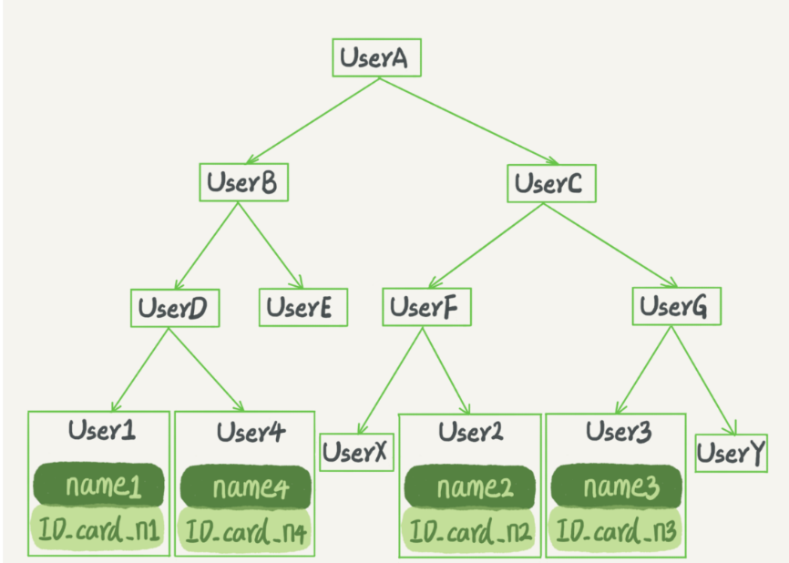

# Mysql

一条sql语句的执行流程


## MYSQL索引

mysql使用索引，就相当于查字典使用目录，目的是为了简化查询时间。

为了提高索引的读写效率，就需要选一个合适的数据结构。例如：哈希表、有序数组、搜索树

==hash表：==

hash表查询的时候是key-value结构，当使用=条件查询的时候查询速度很快。

但是会出现无法范围查询的弊端，因为hash表的key都是根据hash函数进行计算，没有规律的存储顺序。

==顺序数组：==

可以通过二分查找提高查询效率，速度很快，可以范围查询。

缺点就是他的插入效率太低了，插入一条数据，整个数组都需要移动

==搜索树：==

兼顾了查询与插入，在其中寻找到平衡点，并且解决某些问题，Mysql默认使用B+树

原因：

二叉搜索树的特点是：每个节点的左儿子小于父节点，父节点又小于右儿子。这样如果你要查 ID_card_n2 的话，按照图中的搜索顺序就是按照 UserA -> UserC -> UserF -> User2 这个路径得到。这个时间复杂度是 O(log(N))。

二叉树的查询时间复杂度为O（log（n）），但是为了防止二叉树失衡所以插入也是时间复杂度为O（log（n））



例如：

你可以想象一下一棵 100 万节点的平衡二叉树，树高 20。一次查询可能需要访问 20 个数据块。在机械硬盘时代，从磁盘随机读一个数据块需要 10 ms 左右的寻址时间。也就是说，对于一个 100 万行的表，如果使用二叉树来存储，单独访问一个行可能需要 20 个 10 ms 的时间，这个查询可真够慢的。

树可以有二叉，也可以有多叉。多叉树就是每个节点有多个儿子，儿子之间的大小保证从左到右递增。二叉树是搜索效率最高的，但是实际上大多数的数据库存储却并不使用二叉树。其原因是，索引不止存在内存中，还要写到磁盘上

为了让一个查询尽量少地读磁盘，就必须让查询过程访问尽量少的数据块。那么，我们就不应该使用二叉树，而是要使用“N 叉”树。这里，“N 叉”树中的“N”取决于数据块的大小。

 **InnoDB 的索引模型**

使用B+树这个多叉树来存储索引

剩下内容请阅读，非常精彩。

[极客时间 | MySQL实战45讲](file:///E:/Resources/SQL/02-基础篇 (8讲)/04丨深入浅出索引（上）.html)

## MYSQL日志

***为什么要使用日志那？***

mysql使用日志是为了在数据库使用繁忙的时候先将数据记录到日志当中去（内存），当mysql空闲下来的时候再将数据持久化到硬盘当中去，这就是Mysql的WAL Writer - Ahead Logging

举个例子：

如果有人要赊账或者还账的话，掌柜一般有两种做法：

​		在生意红火柜台很忙时，掌柜一定会选择后者，因为前者操作实在是太麻烦了。首先，你得

找到这个人的赊账总额那条记录。你想想，密密麻麻几十页，掌柜要找到那个名字，可能还

得带上老花镜慢慢找，找到之后再拿出算盘计算，最后再将结果写回到账本上。

这整个过程想想都麻烦。

​		相比之下，还是先在粉板上记一下方便。你想想，如果掌柜没有粉

板的帮助，每次记账都得翻账本，效率是不是低得让人难以忍受？

​		同样，在 MySQL 里也有这个问题，如果每一次的更新操作都需要写进磁盘，然后磁盘也

要找到对应的那条记录，然后再更新，整个过程 IO 成本、查找成本都很高。为了解决这个

问题，MySQL 的设计者就用了类似酒店掌柜粉板的思路来提升更新效率。

一种做法是直接把账本翻出来，把这次赊的账加上去或者扣除掉；

另一种做法是先在粉板上记下这次的账，等打烊以后再把账本

Mysql记录日志的过程


这里面涉及了两个日志框架：redo log 和 binlog

==redolog==

InnoDB引擎自带的日志记录框架

操作流程，InnoDB引擎会将需要更新的机器指令记录到redolog日志中；redolog日志的大小是固定的，在写入数据的过程中如果内存占用满了就会将以前写的数据覆盖掉。


==binlog==

这是Mysql自带的日志记录框架

他服务的对象是整个Server层

***redolog与binlog的区别：***

​		1.redo log 是 InnoDB 引擎特有的；binlog 是 MySQL 的 Server 层实现的，所有引擎都

可以使用。

​		 2.redo log 是物理日志，记录的是“在某个数据页上做了什么修改”；binlog 是逻辑日

志，记录的是这个语句的原始逻辑，比如“给 ID=2 这一行的 c 字段加 1 ”。

​		3.redo log 是循环写的，空间固定会用完；binlog 是可以追加写入的。“追加写”是指

binlog 文件写到一定大小后会切换到下一个，并不会覆盖以前的日志。

**举个例子**：

当涉及到数据库操作时，让我们以一个简单的示例来说明 redo log 和 binlog 的区别。

假设我们有一个名为"users"的表，具有以下结构和数据：

```
+----+-------+-----+
| ID | Name  | Age |
+----+-------+-----+
| 1  | John  | 25  |
| 2  | Alice | 30  |
+----+-------+-----+
```

现在，我们执行以下 SQL 语句来更新表中 ID 为 2 的记录的 Age 字段：

```
UPDATE users SET Age = 31 WHERE ID = 2;
```

在这个例子中，我们来看看 redo log 和 binlog 分别记录了什么。

1.  Redo Log：
    Redo log 记录的是物理修改。对于这个更新操作，redo log 记录了以下信息：

    复制

    ```
    - 在第几个数据页上进行了修改
    - 修改的偏移量
    - 修改前后的数据值
    ```

    redo log 的记录可能是类似这样的：

    复制

    ```
    Page: 1234, Offset: 56, Old Value: 30, New Value: 31
    ```

    这样，如果在更新操作后发生了故障，数据库可以使用 redo log 来重做这个修改，将 Age 字段的值恢复为 31。

2.  Binlog：
    Binlog 记录的是逻辑操作。对于这个更新操作，binlog 记录了以下信息：

    复制

    ```
    - 执行的 SQL 语句
    ```

    binlog 的记录可能是类似这样的：

    复制

    ```
    UPDATE users SET Age = 31 WHERE ID = 2;
    ```

    这样，如果需要在其他数据库实例上复制这个更新操作，可以使用 binlog 中的逻辑操作来执行相同的更新。

