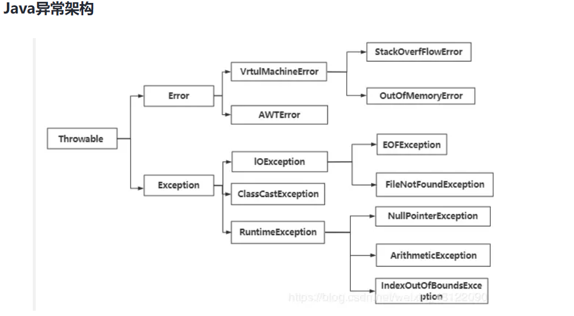
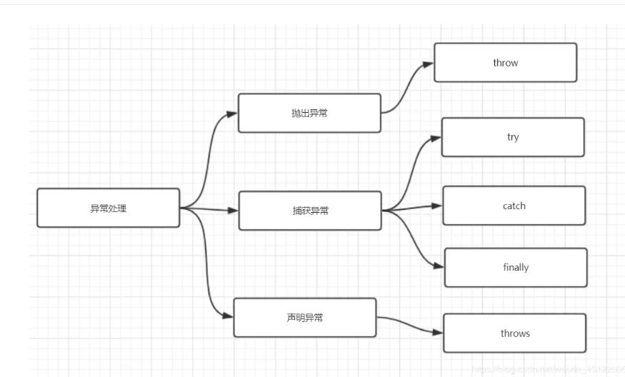
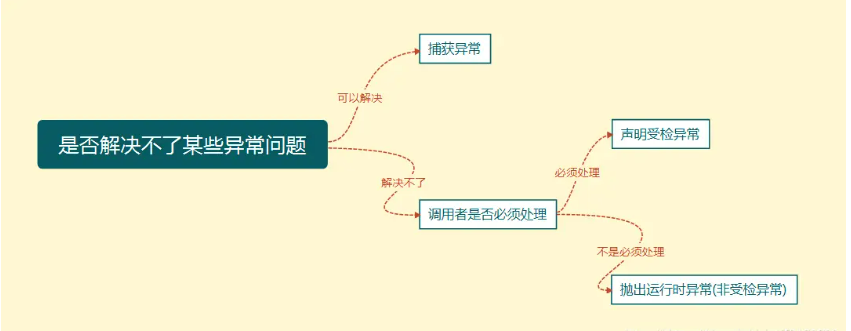
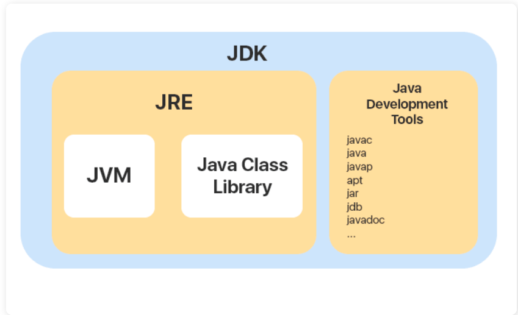

# JVM内存模型

## 1.JVM运行时数据区（内存结构）

线程私有区：

（1）虚拟机栈：每次调用方法都会在虚拟机栈中产生一个栈帧，每个栈帧中都有方法的参数、局部变量、方法出口等信息，方法执行完毕后释放栈帧

（2）本地方法栈：为native修饰的本地方法提供的空间，在HotSpot中与虚拟机合二为一

（3）程序计数器：保存指令执行的地址，方便线程切回后能继续执行代码

线程共享区：

（4）堆内存：Jvm进行垃圾回收的主要区域，存放对象信息，分为新生代和老年代

（5）方法区：存放类信息、静态变量、常量、运行时常量池等信息。JDK1.8之前用持久代实现，JDK1.8后用元空间实现，元空间使用的是本地内存，而非在JVM内存结构中

## 2.什么情况下会内存溢出？

堆内存溢出：（1）当对象一直创建而不被回收时（2）加载的类越来越多时（3)虚拟机栈的线程越来越多时

栈溢出：方法调用次数过多，一般是递归不当造成

## 3.JVM有哪些垃圾回收算法？

（1）标记清除算法： 标记不需要回收的对象，然后清除没有标记的对象，会造成许多内存碎片。

（2）复制算法： 将内存分为两块，只使用一块，进行垃圾回收时，先将存活的对象复制到另一块区域，然后清空之前的区域。用在新生代

（3）标记整理算法： 与标记清除算法类似，但是在标记之后，将存活对象向一端移动，然后清除边界外的垃圾对象。用在老年代

GC机制

## 4.GC如何判断对象可以被回收？

（1）引用计数法：已淘汰，为每个对象添加引用计数器，引用为0时判定可以回收，会有两个对象相互引用无法回收的问题

（2）可达性分析法：从GCRoot开始往下搜索，搜索过的路径称为引用链，若一个对象GCRoot没有任何的引用链，则判定可以回收

GCRoot有：虚拟机栈中引用的对象，方法区中静态变量引用的对象，本地方法栈中引用的对象

## 5.典型垃圾回收器

G1 ：JDK1.9以后的默认垃圾回收器，支持并发，采用标记整理+复制算法，注重响应速度

# IOC

IOC控制反转 将对象的创建权利交给IOC容器来实现，程序员本身就不用new 对象了，实现了解耦合。（IOC是一种思想）将主动创建，变为被动接受

DI（依赖注入是这种思想的实现）

@Component  @Controller  @Service @Repository四个注解将类注册为Bean，在spring看来这四个注解都一样，都是注册Bean的功能

但是自己写的时候需要按照规律来

**使用注解的时候，并没有定义 bean 的 id 和 class，那么 spring 是怎么识别的呢？**

是把当前类的名称首字母小写来识别的。需要的话，你可以在注解中使用value=修改名称，一般不会去修改。

@Autowired 是根据类型来寻找Bean的，如果没有找到此类直接抛异常，如果有多个类型根据Id来判断

@Resource是先根据id来寻找Bean的

区别

@Resource是JDK自带的 扩展性好 按照名字装配

@Autowired 是spring框架自己的，按照类装配

为什么有IOC容器

就像一个工厂，帮助我们去创造产品，我们只需要使用他的产品就行，不需要关注起创建，所以就有了IOC容器

# AOP

面向切面编程，当我们需要为多个对象引入一个公共行为，比如日志，操作记录等，就需要在每个对象中引用公共行为，这样程序就产生了大量的重复代码，使用AOP可以完美解决这个问题

**AOP是怎么实现**

动态代理机制，静态代理是先创建代理类，代理接口，在程序运行之间就已经编译好了。而动态代理的代理对象是在程序加载的过程中去动态生成代理对象。相比静态代理，动态代理的优势就是不用每一个对象都去创建起代理对象。

spring的动态代理

JDK  newProxyInstance() 创建代理对象 InvocationHandler 实现该接口执行      invoke即可进行增强

CGilb    MethodInterceptor接口   执行intercept

# mysql

### mysql事务特性

原子性：一个事务内的操作统一成功或失败

一致性：事务前后的数据总量不变

隔离性：事务与事务之间相互不影响

持久性：事务一旦提交发生的改变不可逆

### 事务靠什么保证

原子性：由undolog日志保证，他记录了需要回滚的日志信息，回滚时撤销已执行的sql

一致性：由其他三大特性共同保证，是事务的目的

隔离性：由MVCC保证

持久性：由redolog日志和内存保证，mysql修改数据时内存和redolog会记录操作，宕机时可恢复

### 事务的隔离级别

在高并发情况下，并发事务会产生脏读、不可重复读、幻读问题，这时需要用隔离级别来控制

读提交： 允许一个事务读取另一个事务已提交的数据，可能出现不可重复读，脏读。

读未提交： 只允许事务读取另一个事务没有提交的数据可能出现不可重复读，幻读。

可重复读： 确保同一字段多次读取结果一致，可能出现欢幻读。

可串行化： 所有事务逐次执行，没有并发问日

Inno DB 默认隔离级别为可重复读级别，分为快照度和当前读，并且通过间隙锁解决了幻读问题。

### 5.什么是快照读和当前读

*快照读读取的是当前数据的可见版本，可能是会过期数据，不加锁的select就是快照都

*当前读读取的是数据的最新版本，并且当前读返回的记录都会上锁，保证其他事务不会并发修改这条记录。如update、insert、delete、select for undate（排他锁）、select lockin share mode（共享锁） 都是当前读

### MVCC是什么

MVCC是多版本并发控制，为每次事务生成一个新版本数据，每个事务都由自己的版本，从而不加锁就决绝读写冲突，这种读叫做快照读。只在读已提交和可重复读中生效。

实现原理由四个东西保证，他们是

undolog日志：记录了数据历史版本

readView:事务进行快照读时产生的视图，记录了当前系统中活跃的事务id，控制哪个历史版本对当前事务可见

隐藏字段DB_TRC_ID： 最近修改记录的事务ID

隐藏字段DB_Roll_PTR： 回滚指针，配合undolog指向数据的上一个版本

### MySQL有哪些索引

主键索引：一张表只能有一个主键索引，主键索引列不能有空值和重复值

唯一索引：唯一索引不能有相同值，但允许为空

普通索引：允许出现重复值

组合索引：对多个字段建立一个联合索引，减少索引开销，遵循最左匹配原则

全文索引：myisam引擎支持，通过建立倒排索引提升检索效率，广泛用于搜索引擎

### 聚簇索引和非聚簇索引的区别

聚簇索引：将索引和值放在了一起，根据索引可以直接获取值，如果主键值很大的话，辅助索引也会变得很大

非聚簇索引：叶子节点存放的是数据行地址，先根据索引找到数据地址，再根据地址去找数据

他们都是b+数结构

### 为什么使用B+树

相对于B树而言，所有的数据都存在叶子节点上，省空间。而且叶子节点形成一条链表，方便查询。

### MySQL如何做慢查询优化

（1）分析sql语句，是否加载了不需要的数据列

（2）分析sql执行计划，字段有没有索引，索引是否失效，是否用对索引

（3）表中数据是否太大，是不是要分库分表

### 哪些情况索引会失效

（1）where条件中有or，除非所有查询条件都有索引，否则失效 （UNION ALL 来合并多条select语句结果集）

（2）like查询用%开头，索引失效（A%不会）

（3）索引列参与计算，索引失效

（4）违背最左匹配原则，索引失效（组合索引时，用第三列作为索引）

（5）索引字段发生类型转换，索引失效

（6）mysql觉得全表扫描更快时（数据少），索引失效

# Redis数据结构

**String（字符串），Hash（哈希），List（列表），Set（集合）、Zset（有序集合）**。

### string：

String 是最基本的 key-value 结构，key 是唯一标识，value 是具体的值 set get  批量设置 设置ttl

作用：缓存对象（String+json）

 常规计数 （Redis单线程，执行的命令有原子性）

分布式锁（set上NX 参数可以实现，**key不存在才插入**）

 共享 Session 信息

### List

： 列表是简单的字符串列表，**按照插入顺序排序**，可以从头部或尾部向 List 列表添加元素

作用：**消息队列**

### Hash

： 是一个键值对（key - value）集合，其中 value 的形式如： value=[{field1，value1}，...{fieldN，valueN}]。Hash 特别适合用于存储对象。


作用：**缓存对象** string+json也能缓存对象   **购物车**

一般对象用 String + Json 存储，对象中某些频繁变化的属性可以考虑抽出来用 Hash 类型存储。

### Set

类型是一个无序并唯一的键值集合，它的存储顺序不会按照插入的先后顺序进行存储。

Set 类型和 List 类型的区别如下：

- List 可以存储重复元素，Set 只能存储非重复元素；
- List 是按照元素的先后顺序存储元素的，而 Set 则是无序方式存储元素的

作用：点赞 共同关注

### Zset

Zset 类型（有序集合类型）相比于 Set 类型多了一个排序属性 score（分值），对于有序集合 ZSet 来说，每个存储元素相当于有两个值组成的，一个是有序结合的元素值，一个是排序值。

有序集合保留了集合不能有重复成员的特性（分值可以重复），但不同的是，有序集合中的元素可以排序。

作用：

**排行榜**

# **CAP**

CAP原则又称CAP定理，指的是在一个分布式系统中，Consistency(一致性)、Availability(可用性)、Partition tolerance(分区容错性)，三者不可兼得。

- 一致性(C):对某个指定的客户端来说，读操作能返回最新的写操作结果.
- ·可用性(A):非故障节点在合理的时间返回合理的响应
- 分区容错性(P):分区容错性是指当网络出现分区(两个节点之间无法连通)之后，系统能否继续履行职责

CAP理论就是说在分布式系统中，最多只能实现上面的两点。而由于当前的网络硬件肯定会出现延迟丢包等问题，所以考虑最差情况，分区容忍性是一般是需要实现的

虽然 CAP理论定义是三个要素中只能取两个，但放到分布式环境下来思考，我们会发现必须选择P(分区容忍)要素，因为网络本身无法做到100%可靠，有可能出故障，所以分区是一个必然的现象。如果我们选择了CA而放弃了P，那么当发生分区现象时，为了保证C，系统需要禁止写入，当有写入请求时，系统返回 eror(例如，当前系统不允许写入)，这又和A冲突了，因为A要求返回 no eror和 no timeout。因此，分布式系统理论上不可能选择 CA 架构，只能选择 CP 或者 AP 架构,

# BASE

BASE理论的核心思想是:即使无法做到强一致性，但每个应用都可以根据自身业务特点，采用适当的方式来使系统达到最终一致性。

# HashMap

### 想要线程安全的HashMap怎么办？

（1）使用ConcurrentHashMap

（2）使用HashTable

（3）Collections.synchronizedHashMap()方法

### ConcurrentHashMap原如何保证的线程安全？

JDK1.7:使用分段锁，将一个Map分为了16个段，每个段都是一个小的hashmap，每次操作只对其中一个段加锁

JDK1.8:采用CAS+Synchronized保证线程安全，每次插入数据时判断在当前数组下标是否是第一次插入，是就通过CAS方式插入，然后判断f.hash是否=-1，是的话就说明其他线程正在进行扩容，当前线程也会参与扩容；删除方法用了synchronized修饰，保证并发下移除元素安全

### HashTable与HashMap的区别

（1）HashTable的每个方法都用synchronized修饰，因此是线程安全的，但同时读写效率很低

（2）HashTable的Key不允许为null

（3）HashTable只对key进行一次hash，HashMap进行了两次Hash

（4）HashTable底层使用的数组加链表

### 集合

**list跟map的差别：**

list是一个有顺序的集合，元素允许重复，也允许增删改。

map是一种键值对集合，key不允许重复和修改，value可变。

使用场景差别：

list（侧重于顺序集合）可以用来保存学生成绩排名

map（侧重于键值对）可以通过学生id找到对应学生成绩

**ArrayList和LinkList分别使用场景**

LinkList：用他实现队列，双向链表

ArrayList：频繁访问，动态扩容，迭代器查询

# JUC

### **线程和进程有什么区别？**

线程具有许多传统进程所具有的特征，故又称为轻型进程(Light—Weight Process)或进程元；而把传统的进程称为重型进程(Heavy—Weight Process)，它相当于只有一个线程的任务。在引入了线程的操作系统中，通常一个进程都有若干个线程，至少包含一个线程。

**根本区别**：进程是操作系统资源分配的基本单位，而线程是处理器任务调度和执行的基本单位

**资源开销**：每个进程都有独立的代码和数据空间（程序上下文），程序之间的切换会有较大的开销；线程可以看做轻量级的进程，同一类线程共享代码和数据空间，每个线程都有自己独立的运行栈和程序计数器（PC），线程之间切换的开销小。

**包含关系**：如果一个进程内有多个线程，则执行过程不是一条线的，而是多条线（线程）共同完成的；线程是进程的一部分，所以线程也被称为轻权进程或者轻量级进程。

**内存分配**：同一进程的线程共享本进程的地址空间和资源，而进程之间的地址空间和资源是相互独立的

**影响关系**：一个进程崩溃后，在保护模式下不会对其他进程产生影响，但是一个线程崩溃整个进程都死掉。所以多进程要比多线程健壮。

### **创建线程的三种方式的对比？**

**1）采用实现Runnable. Callable接口的方式创建多线程。**

**优势是**：

线程类只是实现了Runnable接口或Callable接口，还可以继承其他类。

在这种方式下，多个线程可以共享同一个target对象，所以非常适合多个相同线程来处理同一份资源的情况，从而可以将CPU. 代码和数据分开，形成清晰的模型，较好地体现了面向对象的思想。

**劣势是：**

编程稍微复杂，如果要访问当前线程，则必须使用Thread.currentThread()方法。

**2）使用继承Thread类的方式创建多线程**

**优势是：**

编写简单，如果需要访问当前线程，则无需使用Thread.currentThread()方法，直接使用this即可获得当前线程。

**劣势是：**

线程类已经继承了Thread类，所以不能再继承其他父类。

**3）Runnable和Callable的区别**

-   Callable规定（重写）的方法是call()，Runnable规定（重写）的方法是run()。
-   Callable的任务执行后可返回值，而Runnable的任务是不能返回值的。
-   Call方法可以抛出异常，run方法不可以。
-   运行Callable任务可以拿到一个Future对象，表示异步计算的结果。它提供了检查计算是否完成的方法，以等待计算的完成，并检索计算的结果。通过Future对象可以了解任务执行情况，可取消任务的执行，还可获取执行结果

### 线程池核心参数

1.corePoolSize 核心线程数目 - 池中会保留的最多线程数。

2.maximumPoolSize 最大线程数目 - 核心线程+救急线程的最大数目。

3 keepAliveTime 生存时间 - 救急线程的生存时间，生存时间内没有新任务，此线程资源会释放。

4.unit 时间单位 - 救急线程的生存时间单位，如秒、毫秒等。

5.workQueue - 当没有空闲核心线程时，新来任务会加入到此队列排队，队列满会创建救急线程执行任务。

6.threadFactory 线程工厂 - 可以定制线程对象的创建，例如设置线程名字、是否是守护线程等。

7.handler 拒绝策略 - 当所有线程都在繁忙，workQueue 也放满时，会触发拒绝策略。

### ThreadLocal原理

原理是为每个线程创建变量副本，不同线程之间不可见，保证线程安全。每个线程内部都维护了一个Map，key为threadLocal实例，value为要保存的副本。

但是使用ThreadLocal会存在内存泄露问题，因为key为弱引用，而value为强引用，每次gc时key都会回收，而value不会被回收。所以为了解决内存泄漏问题，可以在每次使用完后删除value或者使用static修饰ThreadLocal，可以随时获取value

### **执行execute()方法和submit()方法的区别是什么呢？**

-   **`execute()` 方法用于提交不需要返回值的任务，所以无法判断任务是否被线程池执行成功与否；**
-   **submit()方法用于提交需要返回值的任务。线程池会返回一个future类型的对象，通过这个future对象可以判断任务是否执行成功**，并且可以通过future的get()方法来获取返回值，get()方法会阻塞当前线程直到任务完成，而使用 `get（long timeout，TimeUnit unit）`方法则会阻塞当前线程一段时间后立即返回，这时候有可能任务没有执行完。

# Java基础

## Java常见面试题

### Liunx常用命令

1.  ls：显示当前目录下的文件夹
2.  cd：跳转到指定目录下面
3.  pwd：显示当前文件位置（忘）
4.  mkdir：创建目录
5.  rm：移除目录或者文件
6.  rmdir：移除空目录，不需要确认
7.  cat：阅读文件里面的内容
8.  more：可以指定向下读取文件内容
9.  less：可以指定向上读文件内容
10.  mv：可以修改文件名称，跟移动文件位置（忘）
11.  cp：复制文件到指定位置（忘+）

### Java异常处理机制



**Throwable**

Throwable是java语言异常中的超类

Throwable有两个接口，Error和Exception

Throwable保存在线程运行时的堆栈快照，提供printStackTrace()方法获取该快照信息

**受检异常和非受检异常**

**受检异常**指的是在编译过程中就需要处理的异常**除 RuntimeException 及其子类外，其他的 Exception 异常都属于受检异常**。

**非受检异常**指的是，在编译时不需要检查的异常**例如RuntimeException和Error**

**Error**

Error接口里面一般都是重大错误，一般都发生在JVM当中；一般Error错误程序都没有错误，我们不需要有任何的处理

**Exception**

-   程序本身可以捕获并且可以处理的异常。Exception 这种异常又分为两类：运行时异常和编译时异常。

RuntimeException 为运行时异常

其他为编译时异常

**Java异常处理关键字**

try:用于监听。如果代码产生异常就会被抛出

catch：用于捕获异常。捕获异常进行处理

finally：finally代码块里面的内容必须去执行，不管发生异常或者异常处理了什么情况，finally里面的代码一定会被执行

throw：抛出异常

throws：声明异常

**Java异常处理方式**



**声明异常**

通常，应该捕获那些知道如何处理的异常，将不知道如何处理的异常继续传递下去。传递异常可以在方法签名处使用 **throws** 关键字声明可能会抛出的异常。

**抛出异常**

-   如果你觉得解决不了某些异常问题，且不需要调用者处理，那么你可以抛出异常。
-   throw关键字作用是在方法内部抛出一个`Throwable`类型的异常。任何Java代码都可以通过throw语句抛出异常。



**捕获异常**

程序通常在运行之前不报错，但是运行后可能会出现某些未知的错误，但是还不想直接抛出到上一级，那么就需要通过try…catch…的形式进行异常捕获，之后根据不同的异常情况来进行相应的处理。

### 重写跟重载的区别

重载发生在一个类中，如果一个类里面的方法名相同，但是参数列表（参数类型，个数）不同，返回类型不要求视为重载

重写发生在子类跟父类之间，要求子类跟父类方法的参数列表和返回类型相同，要求子类权限大于父类，子类异常更加宽泛

### JAVA创建对象的方式

1.  new 出来
2.  反射 Class.newInstance和Constructor.newInstance Class创建的本质是通过Constructor创建对象，Constructor的优点是可以使用有参构造
3.  克隆Clone方法，调用一个对象的Clone（）方法，可以将上个对象拷贝过来，不用构造方法。需要实现Cloneable但是拷贝为浅拷贝，引用对象的地址使用的是同一份
4.  反序列化，ObjectInputStream.readObject（）反序列化对象，但是需要类实现Serializable接口

### 接口跟抽象类的区别

1.  接口只能定义方法，不能实现。而抽象类方法可以定义和实现
2.  接口是被实现的，抽象类是被继承的。 类可以实现多个接口，但只能继承一个父类
3.  接口的成员变量都是被public static final修饰的，必须赋初始值，抽象类的成员变量是被default修饰的，可以在子类定义也可以赋值

### **JVM、JRE及JDK的关系**



**简单来说就是JDK是Java的开发工具，JRE是Java程序运行所需的环境，JVM是Java虚拟机．它们之间的关系是JDK包含JRE和JVM，JRE包含JVM．**

### **JAVA语言特点**

-   Java是一种面向对象的语言
-   Java通过Java虚拟机实现了平台无关性，一次编译，到处运行
-   支持多线程
-   支持网络编程
-   具有较高的安全性和可靠性

### **JAVA和C++的区别**

-   Java 通过虚拟机从而实现跨平台特性，但是 C++ 依赖于特定的平台。
-   Java 没有指针，它的引用可以理解为安全指针，而 C++ 具有和 C 一样的指针。
-   Java 支持自动垃圾回收，而 C++ 需要手动回收。
-   Java 不支持多重继承，只能通过实现多个接口来达到相同目的，而 C++ 支持多重继承。

### **隐式(自动)类型转换和显示(强制)类型转换**

-   隐式(自动)类型转换：从存储范围小的类型到存储范围大的类型。`byte`→`short(char)`→`int`→`long`→`float`→`double`

-   显示(强制)类型转换：从存储范围大的类型到存储范围小的类型。`double`→`float`→`long`→`int`→`short(char)`→`byte`。该类类型转换很可能存在精度的损失。

-   ```java
    //这种写法会报错，s类型为short 而1是int类型
    short s = 1;
    s = s + 1;
    //1.强制类型转换
    short s = 1;
    s = (short)(s + 1);
    //2.第二种强制类型转换
    short s = 1;
    s += 1;
    ```

### **String的不可变性**

在 Java 8 中，`String` 内部使用 `char` 数组存储数据。并且被声明为`final`，因此它不可被继承。

为什么`String`要设计成不可变的呢（不可变性的好处）:

1.可以缓存 `hash` 值（）

因为 `String` 的`hash`值经常被使用，例如`String` 用做 `HashMap` 的 `key`。不可变的特性可以使得 `hash`值也不可变， 因此只需要进行一次计算。

2.常量池优化

`String` 对象创建之后，会在字符串常量池中进行缓存，如果下次创建同样的对象时，会直接返回缓存的引用。

3.线程安全

`String` 不可变性天生具备线程安全，可以在多个线程中安全地使用

### **字符型常量和字符串常量的区别**

1.  形式上: 字符常量是单引号引起的一个字符 字符串常量是双引号引起的若干个字符
2.  含义上: 字符常量相当于一个整形值(ASCII值),可以参加表达式运算 字符串常量代表一个地址值(该字符串在内存中存放位置)
3.  占内存大小 字符常量占两个字节 字符串常量占若干个字节(至少一个字符结束标志)

### **什么是字符串常量池？**

字符串常量池位于堆内存中，专门用来存储字符串常量，可以提高内存的使用率，避免开辟多块空间存储相同的字符串，在创建字符串时 JVM 会首先检查字符串常量池，如果该字符串已经存在池中，则返回它的引用，如果不存在，则实例化一个字符串放到池中，并返回其引用。

### **String 类的常用方法都有那些？**

-   `length()`：返回字符串长度
-   `charAt()`：返回指定索引处的字符
-   `substring()`：截取字符串
-   `trim()`：去除字符串两端空白
-   `split()`：分割字符串，返回一个分割后的字符串数组。
-   `replace()`：字符串替换。
-   `indexOf()`：返回指定字符的索引。
-   `toLowerCase()`：将字符串转成小写字母。
-   `toUpperCase()`：将字符串转成大写字符。

### **String和StringBuffer、StringBuilder的区别是什么？**

1.可变性

`String`不可变，`StringBuilder`和`StringBuffer`是可变的

2.线程安全性

`String`由于是不可变的，所以线程安全。`StringBuffer`对方法加了同步锁或者对调用的方法加了同步锁，所以是线程安全的。 `StringBuilder`并没有对方法进行加同步锁，所以是非线程安全的。

3.性能
$$
StringBuilder`> StringBuffer > String
$$

### **switch 是否能作用在 byte 上，是否能作用在 long 上，是否能作用在 String 上**

`switch`可以作用于`char` `byte` `short` `int`及它们对应的包装类型，`switch`不可作用于`long` `double` `float` `boolean`及他们的包装类型。在 JDK1.5之后可以作用于枚举类型，在JDK1.7之后可作用于`String`类型。

### **访问修饰符**

在Java编程语言中有四种权限访问控制符，这四种访问权限的控制符能够控制类中成员的可见性。其中类有两种`public`、`default`。而方法和变量有 4 种：`public`、`default`、`protected`、`private`。

-   **public** : 对所有类可见。使用对象：类、接口、变量、方法
-   **protected** : 对同一包内的类和所有子类可见。使用对象：变量、方法。 **注意：不能修饰类（外部类）**。
-   **default** : 在同一包内可见，不使用任何修饰符。使用对象：类、接口、变量、方法。
-   **private** : 在同一类内可见。使用对象：变量、方法。 **注意：不能修饰类（外部类）**

### **运算符**

-   **&&和&**
    `&&`和`&`都可以表示逻辑与，但他们是有区别的，共同点是他们两边的条件都成立的时候最终结果才是`true`；不同点是`&&`只要是第一个条件不成立为`false`，就不会再去判断第二个条件，最终结果直接为`false`，而`&`判断的是所有的条件。
-   **||和|**
    `||`和`|`都表示逻辑或，共同点是只要两个判断条件其中有一个成立最终的结果就是`true`，区别是`||`只要满足第一个条件，后面的条件就不再判断，而`|`要对所有的条件进行判断。

### **static关键字**

**1.static变量（静态变量）**

用`static`修饰的变量被称为静态变量，也被称为类变量，可以直接通过类名来访问它。静态变量被所有的对象共享，在内存中只有一个副本，仅当在类初次加载时会被初始化，而非静态变量在创建对象的时候被初始化，并且存在多个副本，各个对象拥有的副本互不影响。

**2.static方法(静态方法)**

`static`方法不依赖于任何对象就可以进行访问，在`static`方法中不能访问类的非静态成员变量和非静态成员方法，因为非静态成员方法/变量都是必须依赖具体的对象才能够被调用，但是在非静态成员方法中是可以访问静态成员方法/变量的。

**3.static代码块（静态代码块）**

静态代码块的主要用途是可以用来优化程序的性能，因为它只会在类加载时加载一次，很多时候会将一些只需要进行一次的初始化操作都放在`static`代码块中进行。如果程序中有多个`static`块，在类初次被加载的时候，会按照`static`块的顺序来执行每个`static`块。

**4.可以通过this访问静态成员变量吗？（可以）**

`this`代表当前对象，可以访问静态变量，而静态方法中是不能访问非静态变量,也不能使用`this`引用。

**5.初始化顺序**

静态变量和静态语句块优先于实例变量和普通语句块，静态变量和静态语句块的初始化顺序取决于它们在代码中的顺序。如果存在继承关系的话，初始化顺序为**父类中的静态变量和静态代码块——子类中的静态变量和静态代码块——父类中的实例变量和普通代码块——父类的构造函数——子类的实例变量和普通代码块——子类的构造函数**

### **break ,continue ,return 的区别及作用**

-   `break`结束当前的循环体
-   `continue`结束本次循环,进入下一次循环
-   `return`结束当前方法

### **面向对象和面向过程的区别**

-   面向过程
    优点：性能比面向对象高，因为类调用时需要实例化，开销比较大，比较消耗资源。
    缺点：没有面向对象易维护、易复用、易扩展
-   面向对象
    优点：易维护、易复用、易扩展，由于面向对象有封装、继承、多态性的特性，可以设计出低耦合的系统，使系统更加灵活、更加易于维护
    缺点：性能比面向过程低

### **面向对象三大特性(封装、继承、多态)　＊＊＊**

-   封装
    **封装就是隐藏对象的属性和实现细节，仅对外公开接口**，控制在程序中属性的读和修改的访问级别。
-   继承
    **继承就是子类继承父类的特征和行为**，使得子类对象（实例）具有父类的实例域和方法，或子类从父类继承方法，使得子类具有父类相同的行为。
-   多态（重要）
    多态是同一个行为具有多个不同表现形式或形态的能力。这句话不是很好理解，可以看这个解释，在Java语言中，多态就是指程序中定义的引用变量所指向的具体类型和通过该引用变量发出的方法调用在编程时并不确定，而是在程序运行期间才确定，即一个引用变量倒底会指向哪个类的实例对象，该引用变量发出的方法调用到底是哪个类中实现的方法，必须在由程序运行期间才能决定。
    在Java中实现多态的三个必要条件：继承、重写、向上转型。继承和重写很好理解，向上转型是指在多态中需要将子类的引用赋给父类对象。

### **== 和 equals 的区别　＊＊＊**

-   ==
    对于基本数据类型，`==`比较的是值；对于引用数据类型，`==`比较的是内存地址。
-   eauals
    对于没有重写`equals`方法的类，`equals`方法和`==`作用类似；对于重写过`equals`方法的类，`equals`比较的是值。

### **hashCode 与 equals（为什么重写equals方法后，hashCode方法也必须重写）**

1.  `equals`方法首先比较的是内存地址，如果内存地址相同，直接返回`true`；如果内存地址不同，再比较对象的类型，类型不同直接返回`false`；类型相同，再比较值是否相同；值相同返回`true`，值不同返回`false`。总结一下，`equals`会比较**内存地址、对象类型、以及值**，内存地址相同，`equals`一定返回`true`；对象类型和值相同，`equals`方法一定返回`true`。
2.  如果没有重写`equals`方法，那么`equals`和`==`的作用相同，比较的是对象的地址值。

-   `hashCode`
    `hashCode`方法返回对象的散列码，返回值是`int`类型的散列码。散列码的作用是确定该对象在哈希表中的索引位置。
    关于`hashCode`有一些约定：

1.  两个对象相等，则`hashCode`一定相同。
2.  两个对象有相同的`hashCode`值，它们不一定相等。
3.  `hashCode()`方法默认是对堆上的对象产生独特值，如果没有重写`hashCode()`方法，则该类的两个对象的`hashCode`值肯定不同

-   为什么重写`equals`方法后，`hashCode`方法也必须重写

1.  根据规定，两个对象相等，`hashCode`值也许相同，所以重写`equals`方法后，`hashCode`方法也必须重写（面试官肯定不是想听这个答案）
2.  `hashCode`在具有哈希机制的集合中起着非常关键的作用，比如`HashMap`、`HashSet`等。以`HashSet`为例，`HashSet`的特点是存储元素时无序且唯一，在向`HashSet`中添加对象时，首相会计算对象的`HashCode`值来确定对象的存储位置，如果该位置没有其他对象，直接将该对象添加到该位置；如果该存储位置有存储其他对象（新添加的对象和该存储位置的对象的`HashCode`值相同），调用`equals`方法判断两个对象是否相同，如果相同，则添加对象失败，如果不相同，则会将该对象重新散列到其他位置。所以重写`equals`方法后，`hashCode`方法不重写的话，会导致所有对象的`HashCode`值都不相同，都能添加成功，那么`HashSet`中会出现很多重复元素，`HashMap`也是同理（因为`HashSet`的底层就是通过`HashMap`实现的），会出现大量相同的`Key`（`HashMap`中的`key`是唯一的，但不同的`key`可以对应相同的`value`）。所以重写`equals`方法后，`hashCode`方法也必须重写。同时因为两个对象的`hashCode`值不同，则它们一定不相等，所以先计算对象的`hashCode`值可以在一定程度上判断两个对象是否相等，提高了集合的效率。总结一下，一共两点：**第一，在`HashSet`等集合中，不重写`hashCode`方法会导致其功能出现问题；第二，可以提高集合效率。**

## 反射

### 何为反射

反射给予了我们程序运行时分析类，以及调用类的能力。他还可以获取类中的属性与方法。

### 反射场景

**框架中也大量使用了动态代理，而动态代理的实现也依赖反射。**

像 Java 中的一大利器 **注解** 的实现也用到了反射

### 反射优缺点

**优点**：可以让咱们的代码更加灵活、为各种框架提供开箱即用的功能提供了便利

**缺点**：让我们在运行时有了分析操作类的能力，这同样也增加了安全问题。比如可以无视泛型参数的安全检查（泛型参数的安全检查发生在编译时）。另外，反射的性能也要稍差点，不过，对于框架来说实际是影响不大的。

### 获取 Class 对象的四种方式

**1.知道具体类的情况下可以使用：**

```java
Class alunbarClass = TargetObject.class;
```

 **2.通过 `Class.forName()`传入类的全路径获取：**

```java
Class alunbarClass1 = Class.forName("cn.javaguide.TargetObject");
```

**3. 通过对象实例`instance.getClass()`获取：**

```java
TargetObject o = new TargetObject();
Class alunbarClass2 = o.getClass();
```

------

 **4.通过类加载器`xxxClassLoader.loadClass()`传入类路径获取:**

```java
ClassLoader.getSystemClassLoader().loadClass("cn.javaguide.TargetObject");
```

------

```java
package cn.javaguide;

import java.lang.reflect.Field;
import java.lang.reflect.InvocationTargetException;
import java.lang.reflect.Method;

public class Main {
    public static void main(String[] args) throws ClassNotFoundException, NoSuchMethodException, IllegalAccessException, InstantiationException, InvocationTargetException, NoSuchFieldException {
        /**
         * 获取 TargetObject 类的 Class 对象并且创建 TargetObject 类实例
         */
        Class<?> targetClass = Class.forName("cn.javaguide.TargetObject");
        TargetObject targetObject = (TargetObject) targetClass.newInstance();
        /**
         * 获取 TargetObject 类中定义的所有方法
         */
        Method[] methods = targetClass.getDeclaredMethods();
        for (Method method : methods) {
            System.out.println(method.getName());
        }

        /**
         * 获取指定方法并调用
         */
        Method publicMethod = targetClass.getDeclaredMethod("publicMethod",
                String.class);

        publicMethod.invoke(targetObject, "JavaGuide");

        /**
         * 获取指定参数并对参数进行修改
         */
        Field field = targetClass.getDeclaredField("value");
        //为了对类中的参数进行修改我们取消安全检查
        field.setAccessible(true);
        field.set(targetObject, "JavaGuide");

        /**
         * 调用 private 方法
         */
        Method privateMethod = targetClass.getDeclaredMethod("privateMethod");
        //为了调用private方法我们取消安全检查
        privateMethod.setAccessible(true);
        privateMethod.invoke(targetObject);
    }
}


```

## 代理模式

代理模式：

**我们使用代理对象来代替对真实对象(real object)的访问，这样就可以在不修改原目标对象的前提下，提供额外的功能操作，扩展目标对象的功能**


**代理模式的主要作用是扩展目标对象的功能，比如说在目标对象的某个方法执行前后你可以增加一些自定义的操作。**

静态代理：

**静态代理中，我们对目标对象的每个方法的增强都是手动完成的（\*后面会具体演示代码\*），非常不灵活（\*比如接口一旦新增加方法，目标对象和代理对象都要进行修改\*）且麻烦(\*需要对每个目标类都单独写一个代理类\*）。** 

上面我们是从实现和应用角度来说的静态代理，从 JVM 层面来说， **静态代理在编译时就将接口、实现类、代理类这些都变成了一个个实际的 class 文件。**