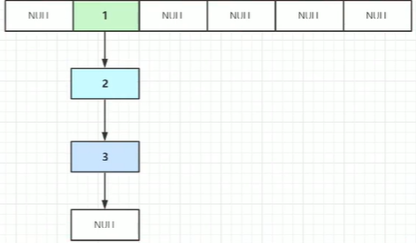

# 八股文

## java基础

5大Java八股核心考点  **JUC** 、**JVM**、 **MySQL** 、**Redis**、 **MQ**（优先学习）

计算机基础 先了解 再深入

### 基础

#### BigDecimal（大 小数）

##### 1.为什么要使用BigDecimal及其原因

此类是为了解决浮点数Float Double 运算不准确

**运算不准确的原因**：

 计算机是二进制，计算机表示一个数字宽度是有限的，超过宽度就会被截取，造成精度丢失。

**十进制小数到二进制小数**：

一般是`整数部分除 2 取余，逆序排列`，`小数部分使用乘 2 取整数位，顺序排列`

小数部分在乘2到整数时停止 0.25在乘2时有整数  而0.1没有

​			2.25


​			2.1


##### 2.BigDecimal的常见方法

###### 2.1创建BigDecimal对象


###### 2.2加减乘除

a.add（b）：将a，b两个BigDecimal对象相加

a.subtract(b) ：将a，b相减

a.multiply(b): 将a，b相乘

a.divide(b):将a，b相除

###### 2.3大小比较

a.compareTo(b):返回**0** 表示**相等**；返回**1**表示 a**大于**b；返回**-1**表示a**小于**b

###### 2.4设置保留位数

通过 `setScale`方法设置保留几位小数以及保留规则

##### 3.BigDecimal等值比较问题

使用equals（）比较不仅会比较数值，还会比较精度。

```java
BigDecimal a = new BigDecimal("1");
BigDecimal b = new BigDecimal("1.0");
System.out.println(a.equals(b));//false

```

这是因为 `equals()` 方法不仅仅会比较值的大小（value）还会比较精度（scale），而 `compareTo()` 方法比较的时候会忽略精度

使用compareTo（）只会比较数值会1忽略精度。

### JUC

### 集合

#### HashMap

1.7put方法源码

```java
public V put(K key, V value) {
    //判断数组是否是空
    if (table == EMPTY_TABLE) {
        //如果为空 初始化数组
        inflateTable(threshold);
    }
    //对key为null的处理
    if (key == null)
        return putForNullKey(value);
    int hash = hash(key);
    //根据hash值获取数组的下标
    int i = indexFor(hash, table.length);
    //根据下标获取对应的Entry对象,遍历链表,判断是否有重复的key,如果有将value替换,返回之前对应的value值
    for (Entry<K,V> e = table[i]; e != null; e = e.next) {
        Object k;
        //判断key是否存在...
        if (e.hash == hash && ((k = e.key) == key || key.equals(k))) {
            V oldValue = e.value;
            e.value = value;
            e.recordAccess(this);
            return oldValue;
        }
    }
    //如果key不重复
    
    //记录修改的次数(快速失败(fail—fast)会使用到)
    modCount++;
    //存入到Entry中,下面分解
    addEntry(hash, key, value, i);
    return null;
}

```

1.8 put方法源码

```java
inal V putVal(int hash, K key, V value, boolean onlyIfAbsent,
                   boolean evict) {
        Node<K,V>[] tab; Node<K,V> p; int n, i;
        if ((tab = table) == null || (n = tab.length) == 0)//判断hash表是否为空，进行初始化
            n = (tab = resize()).length;//跟1.7不同的是这里没有初始化方法，直接将初始化扩容一起并入resize()
        if ((p = tab[i = (n - 1) & hash]) == null)//检查当前数组中是否有链表，没有直接插入，有继续判断
            tab[i] = newNode(hash, key, value, null);
        else {
            Node<K,V> e; K k;
            if (p.hash == hash &&
                ((k = p.key) == key || (key != null && key.equals(k))))
                e = p;//这里判断链表头节点是否跟要插入Node节点一样，不一样就要去接着遍历（需要区别是树还是链表还是数组）
            else if (p instanceof TreeNode)//遍历树节点
                e = ((TreeNode<K,V>)p).putTreeVal(this, tab, hash, key, value);
            else {//遍历链表节点
                for (int binCount = 0; ; ++binCount) {
                    if ((e = p.next) == null) {
                        p.next = newNode(hash, key, value, null);
                        if (binCount >= TREEIFY_THRESHOLD - 1) // -1 for 1st
                            treeifyBin(tab, hash);
                        break;
                    }
                    if (e.hash == hash &&
                        ((k = e.key) == key || (key != null && key.equals(k))))
                        break;
                    p = e;
                }
            }
            if (e != null) { // existing mapping for key
                V oldValue = e.value;
                if (!onlyIfAbsent || oldValue == null)
                    e.value = value;
                afterNodeAccess(e);
                return oldValue;
            }
        }
        ++modCount;
        if (++size > threshold)
            resize();
        afterNodeInsertion(evict);
        return null;
    }
```


**key=null 永远存储在数组的0号索引上**

##### 1.HashMap储存的底层数据结构

**hash碰撞**指的是，两个不同的值（比如张三、李四的学号）经过hash计算后，得到的**hash值相同**，后来的李四要放到原来的张三的位置，但是数组的位置已经被张三占了，**导致冲突**。

------

1.7通过数组+链表（为解决hash冲突，使用拉链法，即在entry对象中加入next，就是增加链表）

1.8通过数组+链表+红黑树

##### 2.HashMap数组里面实际存储的是什么

**对象：一个封装了hash值 Key Value Next 4个属性的对象**

hash 就是Key的hash值   Next 就是节点，指向下一个节点


1.7的时候该对象的名字叫做Entry

1.8的时候该对象的名字叫做Node（节点，因为在1.8之后引用了红黑树，不仅有链表还有红黑树，显然节点更合适）

##### 3.HashMap底层是数组，那么怎么来确定存储下标哪？

数组的存储模式是

```java
arr[0]=xxx
```

需要一个下标，HashMap里面是有Key的，需要由Key去得出index（下标）

**那么问题来了一个任意的对象怎么变成数字并且计算出下标哪？**

通过hashCode，利用hash算法将对象转换为数字

那么这个流程就成为Entry-->Key-->hash-->&-->index

```java
static int indexFor(int h, int length) {
    // assert Integer.bitCount(length) == 1 : "length must be a non-zero power of 2";
    return h & (length-1);
}

```

indexFor方法就是计算下标的方法，他是利用与操作（&）来确定index的

##### 4.为什么1.7Entry插入在头部，1.8Node插入在尾部

###### 4.1    头插法

1.7使用头插法的原因最近访问到的数据下次访问概率变大，这样可以提高效率

扩容代码：


会出现死循环问题，原因是在并发环境下，一个线程扩容的时候将链表顺序修改了，第二个线程按照扩容后的链表继续扩容时会出现，==链表顺序修改，但是指针未修改==。

原哈希表结构


第一个线程扩容



第二个线程扩容，会在第一个线程扩容的基础上，进行。


**头插法需要解决的问题**：

在遍历整个链表的时候是从index开始找的，那么真正的头部就不能遍历到了，需要就真正的头部移动到index中


这就是头部转化到index的示意图

代码演示

```java
new Entry（Key,Value,table[index]）//这是一个新的header
table[index]=new Entry(Key,Value,table[index])    //这行代码完成了节点的插入与转移
//链表中插入头元素，只需要将头元素的next赋值为旧头部即可
//然后更换新头部位置到table[index]中去，新头部对象就为 new Entry（Key,Value,table[index]）   
```

```java
void createEntry(int hash, K key, V value, int bucketIndex) {
    Entry<K,V> e = table[bucketIndex];//记录老的header
    table[bucketIndex] = new Entry<>(hash, key, value, e);//将新header放入index中去
    size++;//再每次创建Entry向数组中存的时候都加1，这样size()方法就不用一一遍历了，效率高
}

```


###### 4.2尾插法

1.8采用尾插法的原因：

我们知道在1.8中链表长度到达8之后会进行树化，即在put方法使用中就会进行遍历，既然都必须遍历了我们就不再使用头插法，直接使用尾插法即可。

我们知道在链表长度等于8的时候就会去扩容，真的是这样吗？

**树化源码**

```java
    final void treeifyBin(Node<K,V>[] tab, int hash) {
        int n, index; Node<K,V> e;
        if (tab == null || (n = tab.length) < MIN_TREEIFY_CAPACITY)//数组长度大于64的时候才会去树化
            resize();
        else if ((e = tab[index = (n - 1) & hash]) != null) {
            TreeNode<K,V> hd = null, tl = null;
            do {
                TreeNode<K,V> p = replacementTreeNode(e, null);
                if (tl == null)
                    hd = p;
                else {
                    p.prev = tl;
                    tl.next = p;
                }
                tl = p;
            } while ((e = e.next) != null);
            if ((tab[index] = hd) != null)
                hd.treeify(tab);
        }
    }
```

为什么数组长度大于64才会去树化，因为扩容之后链表长度也会被缩短，而且内存空间变大。但是当数组大于64的时候，内存空间大小就会到达临界值，这就需要通过树化来解决链表长度过长，get效率低的问题。

##### 5.为什么HashMap的扩容一定的2的幂次方数

```java
static int indexFor(int h, int length) {
    // assert Integer.bitCount(length) == 1 : "length must be a non-zero power of 2";
    return h & (length-1);
}

```

得到hash值之后要去计算index

**&操作：运算法则为遇0得0**

index的计算是使用 与操作（&）来计算的（为什么不用取余哪？二进制中与操作效率更高，数字对数组长度取余，余数一定是0-数组长度；例如x%8那么余数一定是0-7，所以取余操作也可以保证不越界，下标全面，但是效率差）
$$
举例说明
$$

```
16               0001 0000
int（1个字节说明） 1011 0101
&
15               0000 1111
                 0000 0101（因为低位全是1，所以就能表示0-15的所有数）
                
```

```
17               0001 0001
int              1011 0101
&
16               0001 0000
				 0001 0000（因为低位的数不全是1，就不会计算出某些索引）
```

通过上面的例子我们可以知道：

使用2的幂次方倍的数，可以**获取所有的索引**，再配合上**length-1和&操作就不会出现越界**

##### 6.为什么在拿到hashCode之后还要进行右移和异或运算？

```java
final int hash(Object k) {
    int h = hashSeed;
    if (0 != h && k instanceof String) {
        return sun.misc.Hashing.stringHash32((String) k);
    }

    h ^= k.hashCode();

    // This function ensures that hashCodes that differ only by
    // constant multiples at each bit position have a bounded
    // number of collisions (approximately 8 at default load factor).
    h ^= (h >>> 20) ^ (h >>> 12);
    return h ^ (h >>> 7) ^ (h >>> 4);
}

```

在第五个5问题中提到了，必须使用2的次幂，使用**2的次幂方后**对于int来说**高4位其实就没有作用了**，一个int中32位其中28位都没有作用，那么就会出现**hash冲突概率变大***<u>某一个链表太长</u>*，**get效率减慢**

那么我们就要让高28位起到作用，就采用右移的方式，将左边的比特位移到右边，这样就可以全面的用到code值

##### 7.为什么1.8选用红黑树，而不是别的

这是一个折中的考虑，链表他查询插入效率高，查询效率低，而红黑树插入，查询效率都还行。对于Hashmap本身来说，我们即应该保证put效率，又应该保证get效率所以选用了红黑树。

##### 8.为什么树化阈值为8，非树化阈值为6

树化条件为链表长度为8是一个经验值

树化跟非树化条件不一样的原因是，如果都设置为8，那么如果在长度为8的时候经常进行增添或者删除，那么就会一直树化和非树化，会有资源的浪费

##### 9.常见面试题

**为什么在解决 hash 冲突的时候，不直接用红黑树？而选择先用链表，再转红黑树?**

***不用红黑树，用二叉查找树可以么?***

**HashMap 的put方法流程？**

<u>**说说你对红黑树的见解？**</u>

**扩容机制**


### JVM

## 数据库

### MqSQL

#### 1.索引的优劣势

**优势**：

1.使用索引可以大大加快检索数据的速度，这也是使用索引的主要原因。

2.通过创建唯一性索引，可以保证数据库创造的每一行数据的唯一。

**劣势**：

1.创建索引和维护索引需要耗费大量的时间。当数据增删改的时候，索引也需要动态变化，降低sql执行效率。

2.索引的创建需要占用物理磁盘，占用一定空间

**索引一定能够提高检索数据的效率吗？**

一般情况下索引查询比全表查询快，。只有当数据量不大的时候，索引不会带来很大提升

#### 2.脏读，不可重复读，幻读

-   什么是脏读，

    **脏读**：当事务A修改‘a’数据的时候，事物B读取了修改后的‘a’数据并且提交了，事务B提交之后事务A回滚了，那么事务B读到的数据就是脏数据。

    

-   什么是不可重复读

    **不可重复读**：事务A需要多次读取同一条数据‘a’，但是第一次读之后，读取结果为‘a’

    ​						事务A开始第二次读的时候，事务B先执行将其修改为数据‘b’，那么事务A第二次读到的数据为‘b’

    ​						事务A开始第三次读的时候，事务C先执行将其修改为数据‘c’，那么事务A第三次读到的数据为‘c’

    事务A前后对同一条数据读多次，但是每次数据都不一样，这就是不可重复读问题。

    

-   什么是幻读

    **幻读**：事务A多次查询多行数据的时候，事务B在事务A查询的过程中添加了数据，那么事务A第一次读到的记录是10条，第二次读到的记录是20条，这是从无到有。

    **解决办法：**

    在RR隔离级别下对于快照读来说，通过**MVCC**就可以解决幻读。

    MVCC如何解决幻读：在RR隔离级别下，如果是快照读，那么就会生成同一个ReadView（即m_ids，min_trx_id，max_trx_id，creator_trx_id四个值不会发生变化）那么我们就不会读到新增的数据

    但是如果在RR中出现了当前读，那么就需要**Next-Key Locks**解决问题，他是通过加行锁和间隙锁来解决问题的，将该范围本身锁住，和该范围两边区间锁住，不允许进行增删操作

    [MySQL 如何解决幻读（MVCC 原理分析） - 掘金 (juejin.cn)](https://juejin.cn/post/7056583607929798692#heading-10)

### Redis

## 中间件

### MQ

#### RabbitMq交换器类型

Fanout：广播模式，将消息放送到该Exchange的所有队列里面去

Direct：指定发送到对应routingkey的队列中去，我规定该消息只能发送到routingkey为orginal的队列中去，也可以指定多个数值

Topic：主题模式，routing_key 不能随意写（stock.usd.nyse）类似这种，发送给主题为stock的队列

Hearders：给消息的Hearder属性设置键值对，发送给有相同Header属性的消息队列中去。

#### Mq重复消费问题怎么解决

什么时候会出现重复消息那？

在网络状态不好的时候，rabbitmq会在恢复网络的时候，就会继续给消费者投递之前的消息

怎么解决重复消费的问题哪？

使用全局唯一id

**1、消费者监听到消息后获取id，先去查询这个id是否存中**

**2、如果不存在，则正常消费消息，并把消息的id存入 数据库或者redis中（下面的编码示例使用redis）**

**3、如果存在则丢弃此消息**

单消费者采用string来储存，验证一条id之后就，就将其保存起来验证下一条消息

多消费者模式可以采用list，但是需要定时清空一些数据

**将id以key值增量存入string中并设置过期时间**

#### **异步发送，消息可靠性怎么保证？**

一般会有三个方面导致消息丢失

-   生产者消息丢失；出现异常没有重发消息，网络问题
-   MQ丢失；MQ宕机
-   消费者丢失；在消费者消费的过程服务器宕机，消费者会认为消费成功了

***解决方案：***

<u>生产者消息丢失：</u>

通过==回调通知==来解决问题，生产者发送消息后，需要得到确认消息消费的信息然后才会停止重发消息。

通过JOB实现重发消息


<u>MQ消息丢失：</u>

如果生产者保证消息发送到MQ，而MQ收到消息后还在内存中，这时候宕机了又没来得及同步给从节点，就有可能导致消息丢失。

RocketMQ有同步刷盘和异步刷盘两种方式，采用异步刷盘可能会导致消息丢失。通过同步刷盘来确保消息不丢失

<u>消费者消息丢失：</u>

消息如果在消费者这里丢失了，那么消费者就不能返回**ack确认消息**是否成功发送，那么生产者就会重发消息，来保证消息不被丢失。

#### **消费者消费失败的问题，如果一直消费失败导致消息积压怎么处理**

1.消费者一直消费失败说明消费者代码逻辑出现问题，应该先修理消费者

2.如果来不及修复消费者，我们应该临时提供一个消费方案处理堆积到MQ中的资源，并且将消息发送到一个新的交换器当中，避免原来的MQ压力过大崩溃

3.处理完堆积消息之后，立刻开展对消费者的修理。

#### **MQ如何保证消息的顺序**

1.为什么要确保消息的顺序哪？

因为多个操作对同一个数据修改顺序不一致会造成不可预估的风险，例如我们对数据库修改的操作本来应该是插入-更新-删除，但是因为我们没有确保消息的顺序执行，可能出现的情况就是删除-插入-更新。这不就错误的删除了数据了吗，数据库的数据不就不准确了。

2.什么情况下会造成数据不一致。

在RabbitMQ当中一个queue对应多个消费者，多个消费者获取消息是有顺序的，但是执行消息的时间不固定，这样就有可能出现消息顺序错误。

在RabbitMQ当中一个queue对应一个消费者，但是这个消费者是多线程处理消息，也会导致顺序发生变化

3.如何解决

将一个queue设置一个consumer，这样会造成吞吐量下降，但是可以解决问题

在多线程环境下，consumer内部通过内存队列进行排列，然后分发给底层的不同wroker处理

## 计算机基础

### 计算机网络

### 操作系统


